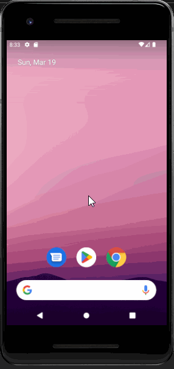

# Developed by Piyusha Gurung, 77261101

## Unit Converter Application

It is a unit application for Android where user can convert values between different units of measurement such as milliliters to fluid ounces and grams to cups and also can choose to perform reverse conversion of the units.

## Key Features of Unit Converter Application :

1. Numeric Value Input
2. Unit Conversion Options
3. Conversion Calculation
4. Reverse Calculation
5. Result Display
6. Error Handling

